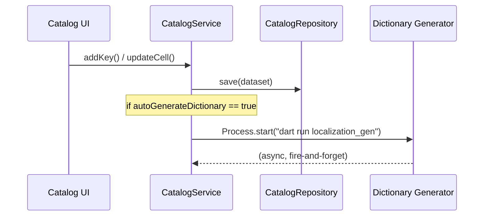

# Auto Generate Dictionary Config

## Context

Currently, when keys are added or edited via the Catalog UI or API, only the translation files (JSON/YAML/CSV/ARB) and catalog state are saved. Regenerating `dictionary.dart` is a separate manual step (`dart run anas_localization:localization_gen` or `anas update --gen`). This feature adds a config toggle so dictionary generation happens automatically.

## Architecture

The dictionary generator lives in `bin/generate_dictionary.dart` and cannot be directly imported from `lib/` code. The `CatalogService` (in `lib/`) will trigger regeneration by spawning a subprocess (`dart run anas_localization:localization_gen`) from the project root. This is the same approach used by the migration validation helper.

## Changes

### 1. Add `autoGenerateDictionary` to `CatalogConfig`

**File:** `[lib/src/features/catalog/config/catalog_config.dart](lib/src/features/catalog/config/catalog_config.dart)`

- Add `final bool autoGenerateDictionary;` field (default: `true`)
- Update: constructor, `copyWith`, `toMap`, `toYamlString`, `defaults()`, `load()` (parse from YAML with `_parseBool` fallback `true`)
- YAML key name: `auto_generate_dictionary`

### 2. Add dictionary generation trigger to `CatalogService`

**File:** `[lib/src/features/catalog/use_cases/catalog_service.dart](lib/src/features/catalog/use_cases/catalog_service.dart)`

- Add a private helper method `_triggerDictionaryGeneration()` that:
  - Checks `config.autoGenerateDictionary`; returns immediately if `false`
  - Spawns `Process.start('dart', ['run', 'anas_localization:localization_gen'])` from `projectRootPath`
  - Runs asynchronously (fire-and-forget) so it does not block the API response
  - Catches and silently swallows errors (dictionary gen failure should not break the catalog)
- Call `_triggerDictionaryGeneration()` at the end of:
  - `addKey()` (after `_repository.save` + `_stateStore.save`)
  - `updateCell()` (after `_repository.save` + `_stateStore.save`)

### 3. Expose config in meta endpoint (optional but useful for UI)

**File:** `[lib/src/features/catalog/domain/entities/catalog_models.dart](lib/src/features/catalog/domain/entities/catalog_models.dart)`

- Add `autoGenerateDictionary` to `CatalogMeta` so the UI can read the current setting

**File:** `[lib/src/features/catalog/use_cases/catalog_service.dart](lib/src/features/catalog/use_cases/catalog_service.dart)`

- Pass `config.autoGenerateDictionary` when building `CatalogMeta` in `loadMeta()`

### 4. Allow toggling via config API

**File:** `[lib/src/features/catalog/server/catalog_backend.dart](lib/src/features/catalog/server/catalog_backend.dart)`

- Extend `PATCH /api/catalog/config` to also accept `autoGenerateDictionary` boolean

**File:** `[lib/src/features/catalog/use_cases/catalog_service.dart](lib/src/features/catalog/use_cases/catalog_service.dart)`

- Add `updateAutoGenerateDictionary(bool value)` method that updates config + writes YAML

### 5. Update tests

- Update any existing tests that construct `CatalogConfig` to include the new field
- Add a test verifying that `autoGenerateDictionary` defaults to `true`
- Add a test verifying YAML round-trip (write then load) preserves the value
