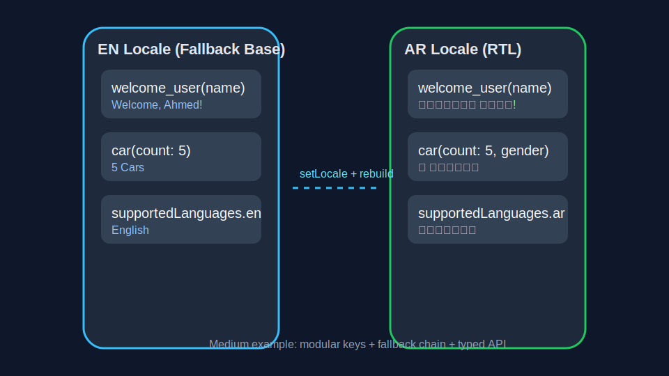

## In Memory of Anas Al-Sharif [](https://github.com/TheBSD/StandWithPalestine/blob/main/docs/README.md)


 
This package is dedicated to the memory of Anas Al-Sharif, a Palestinian journalist for Al Jazeera in Gaza. Anas was martyred while reporting in August 2025, courageously bringing truth to the world. This work serves as a Sadaqah Jariyah (ongoing charity) in his name, honoring his legacy and commitment to justice.


# Flutter/Dart Localization Package

This package provides a comprehensive solution for localization in Flutter and Dart applications. It supports runtime dictionary generation, JSON-based translations, pluralization, named and positional parameters, gender support (male/female only), Arabic gender-aware pluralization, and merging of package and app assets for seamless localization management.

[](https://github.com/Melsaeed276/anas_localization/actions/workflows/pr-tests.yml)
[](https://github.com/Melsaeed276/anas_localization/actions/workflows/benchmark.yml)
[](https://github.com/Melsaeed276/anas_localization/actions/workflows/release-gate.yml)
[](LICENSE)

## Why this package?

Use `anas_localization` when you need:

- Type-safe generated dictionary APIs instead of raw key strings.
- Deterministic locale fallback chain with script/region handling.
- Practical CLI workflows (`validate`, import/export ARB/CSV/JSON, stats).
- Generator module namespaces for large projects (`--modules`, `--module-depth`).
- Flexible runtime loaders (JSON/YAML/CSV/HTTP) and preview dictionaries.

### Comparison at a glance

| Capability | Flutter `gen_l10n` | `easy_localization` | `slang` | `anas_localization` |
| --- | --- | --- | --- | --- |
| Typed accessors | ✅ | ⚠️ (optional/codegen addons) | ✅ | ✅ |
| Runtime asset format flexibility | ⚠️ (ARB-focused) | ✅ | ✅ | ✅ |
| ARB bridge import/export | Native ARB | ⚠️ | ✅ | ✅ |
| Built-in CLI validation profiles | ❌ | ⚠️ | ✅ | ✅ |
| Deterministic script-aware fallback chain | ⚠️ custom | ⚠️ package behavior | ✅ | ✅ |
| Module namespace generation | ❌ | ❌ | ✅ | ✅ |
| Migration docs from competitors | N/A | ⚠️ community | ⚠️ | ✅ |

Tradeoffs:

- `gen_l10n` is the most official path for ARB-first setups.
- `slang` is very strong for compile-time generation ecosystems.
- `easy_localization` is simple to adopt quickly.
- `anas_localization` prioritizes migration tooling, runtime flexibility, and CI-friendly validation workflows.

## Features

- **Dictionary Factory Input**: Apps provide their generated Dictionary class directly to AnasLocalization
- **No State Management Required**: Built-in state management handles locale changes automatically
- **Smooth Language Transition Overlay**: Beautiful animated transition when changing languages
- **Merge app and package JSON localizations** with app override
- **Runtime fallback** to package localization if an app key is missing
- **Deterministic locale fallback chain** (`lang_script_region -> lang_script -> lang_region -> lang -> fallback`)
- **Advanced Pluralization support** including Arabic gender-aware pluralization
- **Gender-specific messages** supporting male and female variants
- **Named parameters** with optional (`{name?}`) and required (`{name!}`) syntax
- **Placeholder markers** for flexible parameter handling
- **Arabic linguistic support** with proper count-based and gender-based pluralization
- **Keyword safety** - automatically converts Dart reserved words (e.g., `continue` → `continueText`)
- **Multi-language consistency validation** across all supported languages
- **Type-safe access** to translations through generated getters
- **Pluggable translation loaders** (JSON default, optional YAML/CSV/HTTP)

## Getting started

Add the package to your `pubspec.yaml` dependencies:

```yaml
dependencies:
  anas_localization: ^0.1.0
```

Run `flutter pub get` to install the package.

## Setup

1. **Create your JSON localization files** in your Flutter project:

```
assets/lang/en.json
assets/lang/ar.json
assets/lang/tr.json
```

`AnasLocalization` reads from `assets/lang` by default. If your files are in a different folder, set `assetPath` in `AnasLocalization`.


### Flutter Preview support

You can provide in-memory dictionaries for Flutter preview/tests where bundle assets may not be available:

```dart
return AnasLocalization(
  fallbackLocale: const Locale('en'),
  assetLocales: const [Locale('en'), Locale('ar')],
  previewDictionaries: const {
    'en': {'app_name': 'Preview App'},
    'ar': {'app_name': 'تطبيق المعاينة'},
  },
  app: const MyApp(),
);
```

When `previewDictionaries` is set, those values are used before asset files.

2. **Generate the Dictionary class**:

```bash
dart run anas_localization:localization_gen
```

Watch mode for incremental regeneration:

```bash
dart run anas_localization:localization_gen --watch
```

Namespaced/module output for large keyspaces:

```bash
dart run anas_localization:localization_gen --modules
dart run anas_localization:localization_gen --modules-only
dart run anas_localization:localization_gen --modules --module-depth=2
```

### CLI utilities (optional)

You can manage and validate translation files with the package CLI:

```bash
dart run anas_localization:anas_cli validate assets/lang
dart run anas_localization:anas_cli validate assets/lang --profile=strict --fail-on-warnings
dart run anas_localization:anas_cli validate assets/lang --profile=strict --schema-file=assets/lang/placeholder_schema.json
dart run anas_localization:anas_cli validate assets/lang --disable=placeholders,gender
dart run anas_localization:anas_cli add-key home.title "Home" assets/lang
dart run anas_localization:anas_cli remove-key home.title assets/lang
dart run anas_localization:anas_cli export assets/lang json translations_export.json
dart run anas_localization:anas_cli import translations_export.json assets/lang
dart run anas_localization:anas_cli export assets/lang arb lib/l10n
dart run anas_localization:anas_cli import l10n.yaml assets/lang
dart run anas_localization:anas_cli stats assets/lang
```

Alias command is also available:

```bash
dart run anas_localization:cli help
```

### Validation profiles

`validate` supports policy tuning:

- `--profile=strict` (CI-friendly, deterministic failures)
- `--profile=balanced` (default; extra keys as warnings)
- `--profile=lenient` (placeholder/plural/gender checks disabled)
- `--disable=missing,extra,placeholders,schema,plural,gender` for per-rule toggles
- `--extra-as-errors` / `--extra-as-warnings`
- `--fail-on-warnings`
- `--schema-file=<path>` for optional placeholder schema sidecar (`default` + optional `locales`)

Schema sidecar shape example:

```json
{
  "default": {
    "cart_summary": {
      "count": {"type": "int", "required": true},
      "amount": {"type": "double", "format": "currency"}
    }
  },
  "locales": {
    "tr": {
      "cart_summary": {
        "count": {"type": "int"},
        "amount": {"type": "double", "format": "currency"}
      }
    }
  }
}
```

### ARB + `gen_l10n` compatibility

- Import ARB files directly (single file or directory).
- Import using a Flutter `l10n.yaml` configuration file.
- Export your package translations to ARB files for translator workflows.
- See migration guides:
  - `doc/MIGRATION_GEN_L10N.md`
  - `doc/MIGRATION_EASY_LOCALIZATION.md`

### Example matrix (medium + advanced)

- Medium and advanced project structures are documented in `example/README.md`.
- Visual outputs:
  - 
  - 

### Benchmark harness

Benchmark script (1k/5k/10k keys, cold load, hot switch, memory RSS):

```bash
dart run benchmark/localization_benchmark.dart
dart run benchmark/localization_benchmark.dart --output benchmark/baseline.json
dart run benchmark/localization_benchmark.dart --compare benchmark/baseline.json --max-regression=0.50
```

### Custom translation loaders

You can replace or extend loaders without changing app code:

```dart
LocalizationService.setTranslationLoaders([
  const JsonTranslationLoader(),
  const YamlTranslationLoader(),
  const CsvTranslationLoader(),
]);
```

3. **Configure your app** with the generated Dictionary:

```dart
import 'package:anas_localization/localization.dart';
import 'generated/dictionary.dart' as app_dictionary;

class MyApp extends StatelessWidget {
  @override
  Widget build(BuildContext context) {
    return AnasLocalization(
      fallbackLocale: const Locale('en'),
      assetPath: 'assets/lang', // optional if you use a custom path
      assetLocales: const [
        Locale('ar'),
        Locale('en'),
        Locale('tr'),
      ],
      dictionaryFactory: (Map<String, dynamic> map, {required String locale}) {
        return app_dictionary.Dictionary.fromMap(map, locale: locale);
      },
      app: MaterialApp(
        // your app configuration
      ),
    );
  }
}
```

## Usage

### Basic Translation Access

```dart
final dictionary = AnasLocalization.of(context).dictionary as YourAppDictionary;

// Simple string access
Text(dictionary.appName)
Text(dict.welcome)

// With parameters
Text(dict.welcomeUser(name: 'Ahmed'))
```

### Placeholder Markers

Support for optional and required parameter markers:

```json
{
  "greeting": "Hello, {name!}!",
  "farewell": "Goodbye, {name?}.",
  "money": "{name?} has {amount} {currency}"
}
```

- `{name!}` - Required parameter (generates `required String name`)
- `{name?}` - Optional parameter (generates `String? name`)  
- `{name}` - Default required parameter

```dart
dictionary.greeting(name: 'Alice')  // Required parameter
dictionary.farewell(name: 'Bob')    // Optional parameter  
dictionary.money(name: 'John', amount: '500', currency: 'USD')
```

### Simple Pluralization

```json
{
  "car": {
    "one": "Car",
    "more": "{count} Cars"
  }
}
```

```dart
dictionary.car(count: 1)  // "Car"
dictionary.car(count: 5)  // "5 Cars"
```

### Arabic Gender-Aware Pluralization

Full support for Arabic linguistic rules with gender variations:

```json
{
  "car": {
    "one": {
      "male": "سيارة واحدة",
      "female": "سيارة واحدة"
    },
    "two": {
      "male": "سيارتان", 
      "female": "سيارتان"
    },
    "few": {
      "male": "{count} سيارات",
      "female": "{count} سيارات"
    },
    "many": {
      "male": "{count} سيارة",
      "female": "{count} سيارة"
    }
  }
}
```

```dart
// Arabic pluralization with gender support
dictionary.car(count: 1, gender: 'male')    // "سيارة واحدة"
dictionary.car(count: 2, gender: 'female')  // "سيارتان" 
dictionary.car(count: 5, gender: 'male')    // "5 سيارات"

// Works for other languages too (ignores gender parameter)
dict.car(count: 1)  // "Car" (English), "Araba" (Turkish)
dict.car(count: 5)  // "Cars" (English), "Arabalar" (Turkish)
```

### Arabic Pluralization Rules

The system automatically applies proper Arabic pluralization rules:

- `count == 0` → "zero" form
- `count == 1` → "one" form  
- `count == 2` → "two" form
- `count >= 3 && count <= 10` → "few" form
- `count >= 11` → "many" form
- Fallback → "other" form

Each form can have both "male" and "female" variants for complete Arabic linguistic support.

### Standard Pluralization (ICU Format)

```json
{
  "items": {
    "zero": "No items",
    "one": "One item", 
    "two": "Two items",
    "few": "A few items",
    "many": "Many items",
    "other": "{count} items"
  }
}
```

### Keyword Safety

The system automatically handles Dart reserved keywords:

```json
{
  "continue": "Continue"
}
```

Generates:
```dart
String get continueText => getString('continue');  // Safe identifier
```

## Advanced Usage

### Built-in State Management

The localization system includes built-in state management, so you don't need to use any external state management solutions like Provider, Bloc, or Riverpod for localization:

```dart
// No additional state management needed!
class MyApp extends StatelessWidget {
  @override
  Widget build(BuildContext context) {
    return AnasLocalization(
      // Built-in state management handles everything automatically
      fallbackLocale: const Locale('en'),
      assetPath: 'assets/lang', // optional if you use a custom path
      assetLocales: const [Locale('ar'), Locale('en'), Locale('tr')],
      dictionaryFactory: (map, {required locale}) => Dictionary.fromMap(map, locale: locale),
      app: MaterialApp(
        // The entire app automatically rebuilds when locale changes
        locale: AnasLocalization.of(context).locale,
        home: HomePage(),
      ),
    );
  }
}

// Change language from anywhere in your app
class LanguageSelector extends StatelessWidget {
  @override
  Widget build(BuildContext context) {
    return ElevatedButton(
      onPressed: () {
        // Built-in state management handles the locale change
        AnasLocalization.of(context).setLocale(Locale('ar'));
        // Entire app automatically rebuilds with new language
      },
      child: Text('Switch to Arabic'),
    );
  }
}
```

**What's handled automatically:**
- ✅ Locale state management and persistence
- ✅ Dictionary loading and caching
- ✅ Widget tree rebuilding on locale changes
- ✅ Fallback locale handling
- ✅ Asset loading and error handling
- ✅ Memory management and cleanup

### Multi-language Consistency

The generator validates that all languages have consistent:
- Key structures (all languages must have the same keys)
- Parameter placeholders (same parameters across languages)  
- Type consistency (String vs Map structures must match)

### Package + App Asset Merging

- Package provides base translations
- Apps can override specific keys
- Runtime fallback to package translations for missing app keys

## File Structure

```
your_app/
├── assets/lang/
│   ├── en.json      # App-specific English translations
│   ├── ar.json      # App-specific Arabic translations  
│   └── tr.json      # App-specific Turkish translations
├── lib/generated/
│   └── dictionary.dart  # Generated Dictionary class
└── lib/main.dart
```

## Migration from Setup Function

**Old approach** (deprecated):
```dart
void main() {
  dictionary_file.setupDictionary(); // No longer needed
  runApp(MyApp());
}
```

**New approach** (recommended):
```dart
void main() {
  runApp(MyApp()); // Dictionary factory passed directly to AnasLocalization
}
```

## Additional Information

For issues, contributions, and more information, visit the GitHub repository:  
https://github.com/Melsaeed276/anas_localization/issues

**Language Support**: All locales defined in your JSON assets are supported, with special enhanced support for Arabic including gender-aware pluralization.

**Gender Support**: Currently supports male and female variants, with plans for expanded gender support.

**Validation**: Automatic validation ensures JSON keys and variables are consistent across all languages to prevent runtime errors.

## Contributing & Security

- Contribution guide: `CONTRIBUTING.md`
- Security policy and reporting: `SECURITY.md`

## License and Trademark

- License: Apache License 2.0 (`LICENSE`)
- Arabic translation (unofficial): `LICENSE.ar.md` (English `LICENSE` remains the legal source of truth)
- Attribution notices: `NOTICE`
- Name/branding policy: `TRADEMARK.md`

If you redistribute a modified version, do not present it as the official `anas_localization` package.

# Remember
[](https://thebsd.github.io/StandWithPalestine)

## Smooth Language Transition Overlay

The package includes a beautiful smooth language transition overlay that provides a smooth, animated transition when users change languages. This feature creates a professional user experience similar to iOS system language changes.

### Features

- **Smooth animations** with fade in/out transitions
- **Localized loading text** that updates during the transition
- **Customizable appearance** (colors, duration, progress indicator)
- **Automatic fallback** to direct locale changes when disabled
- **Production-ready** with easy enable/disable options

### Quick Setup (Recommended)

Use `AnasLocalizationWithSetup` for the easiest setup with setup overlay enabled by default:

```dart
import 'package:anas_localization/localization.dart';
import 'generated/dictionary.dart' as app_dictionary;

class MyApp extends StatelessWidget {
  @override
  Widget build(BuildContext context) {
    return AnasLocalizationWithSetup(
      // Setup overlay is enabled by default
      fallbackLocale: const Locale('en'),
      assetPath: 'assets/localization', // custom path example
      assetLocales: const [
        Locale('ar'),
        Locale('en'), 
        Locale('tr'),
      ],
      dictionaryFactory: (map, {required locale}) {
        return app_dictionary.Dictionary.fromMap(map, locale: locale);
      },
      child: MaterialApp(
        title: 'My App',
        home: HomePage(),
      ),
    );
  }
}
```

### Manual Setup with AnasLanguageSetupOverlay

For more control, wrap your MaterialApp with `AnasLanguageSetupOverlay`:

```dart
import 'package:anas_localization/localization.dart';
import 'generated/dictionary.dart' as app_dictionary;

class MyApp extends StatelessWidget {
  @override
  Widget build(BuildContext context) {
    return AnasLocalization(
      fallbackLocale: const Locale('en'),
      assetPath: 'assets/lang', // optional if you use a custom path
      assetLocales: const [
        Locale('ar'),
        Locale('en'),
        Locale('tr'),
      ],
      dictionaryFactory: (map, {required locale}) {
        return app_dictionary.Dictionary.fromMap(map, locale: locale);
      },
      app: AnasLanguageSetupOverlay(
        duration: const Duration(milliseconds: 2000), // Custom duration
        backgroundColor: Colors.white,                // Custom background
        textColor: Colors.black,                     // Custom text color
        showProgressIndicator: true,                 // Show loading spinner
        child: MaterialApp(
          title: 'My App',
          home: HomePage(),
        ),
      ),
    );
  }
}
```

### Customization Options

The setup overlay can be fully customized:

```dart
AnasLanguageSetupOverlay(
  // Animation timing
  duration: const Duration(milliseconds: 1500),     // Total overlay duration
  
  // Visual appearance  
  backgroundColor: Theme.of(context).colorScheme.surface,
  textColor: Theme.of(context).colorScheme.onSurface,
  showProgressIndicator: true,                      // Show/hide spinner
  
  child: MaterialApp(...),
)
```

### Using Language Selector Widgets

The package provides pre-built language selector widgets that automatically work with the setup overlay:

#### 1. Dropdown Language Selector

```dart
import 'package:anas_localization/localization.dart';

class LanguageSettings extends StatelessWidget {
  @override
  Widget build(BuildContext context) {
    return Scaffold(
      appBar: AppBar(title: Text('Language Settings')),
      body: Padding(
        padding: EdgeInsets.all(16),
        child: Column(
          children: [
            // Dropdown selector - automatically triggers setup overlay
            AnasLanguageSelector(
              supportedLocales: const [
                Locale('en'),
                Locale('ar'), 
                Locale('tr'),
              ],
              decoration: InputDecoration(
                labelText: 'Select Language',
                border: OutlineInputBorder(),
              ),
              onLocaleChanged: (locale) {
                print('Language changed to: ${locale.languageCode}');
              },
            ),
          ],
        ),
      ),
    );
  }
}
```

#### 2. Toggle Language Button

```dart
// Simple two-language toggle
AnasLanguageToggle(
  primaryLocale: const Locale('en'),
  secondaryLocale: const Locale('ar'),
  onLocaleChanged: (locale) {
    print('Toggled to: ${locale.languageCode}');
  },
)
```

#### 3. Dialog Language Selector

```dart
// Modern dialog-style language picker
AnasLanguageDialog(
  supportedLocales: const [
    Locale('en'),
    Locale('ar'),
    Locale('tr'),
  ],
  showDescription: true,                    // Show helper text
  onLocaleChanged: (locale) {
    print('Selected: ${locale.languageCode}');
  },
)
```

### How to Disable the Setup Overlay

#### Option 1: Use Standard AnasLocalization (No Overlay)

```dart
class MyApp extends StatelessWidget {
  @override
  Widget build(BuildContext context) {
    return AnasLocalization(
      // No setup overlay - direct locale changes
      fallbackLocale: const Locale('en'),
      assetPath: 'assets/lang', // optional if you use a custom path
      assetLocales: const [Locale('ar'), Locale('en'), Locale('tr')],
      dictionaryFactory: (map, {required locale}) {
        return app_dictionary.Dictionary.fromMap(map, locale: locale);
      },
      app: MaterialApp(
        title: 'My App',
        home: HomePage(),
      ),
    );
  }
}
```

#### Option 2: Disable in AnasLocalizationWithSetup

```dart
class MyApp extends StatelessWidget {
  @override
  Widget build(BuildContext context) {
    return AnasLocalizationWithSetup(
      // Disable the setup overlay
      enableSetupScreen: false,             // 👈 Disable setup overlay
      fallbackLocale: const Locale('en'),
      assetPath: 'assets/lang', // optional if you use a custom path
      assetLocales: const [Locale('ar'), Locale('en'), Locale('tr')],
      dictionaryFactory: (map, {required locale}) {
        return app_dictionary.Dictionary.fromMap(map, locale: locale);
      },
      child: MaterialApp(
        title: 'My App',
        home: HomePage(),
      ),
    );
  }
}
```

#### Option 3: Conditional Setup Based on Environment

```dart
class MyApp extends StatelessWidget {
  @override
  Widget build(BuildContext context) {
    return AnasLocalizationWithSetup(
      // Disable in debug mode, enable in release
      enableSetupScreen: kReleaseMode,      // Only show in production
      // Or disable for testing
      enableSetupScreen: !kDebugMode,       // Hide during development
      fallbackLocale: const Locale('en'),
      assetPath: 'assets/lang', // optional if you use a custom path
      assetLocales: const [Locale('ar'), Locale('en'), Locale('tr')],
      dictionaryFactory: (map, {required locale}) {
        return app_dictionary.Dictionary.fromMap(map, locale: locale);
      },
      child: MaterialApp(
        title: 'My App',
        home: HomePage(),
      ),
    );
  }
}
```

### Programmatic Language Changes

You can trigger language changes programmatically, and they will automatically use the setup overlay if enabled:

```dart
class LanguageController {
  static void changeToArabic(BuildContext context) {
    // Automatically uses setup overlay if available
    AnasLocalization.of(context).setLocale(const Locale('ar'));
  }
  
  static void changeToEnglish(BuildContext context) {
    // Falls back to direct change if overlay is disabled
    AnasLocalization.of(context).setLocale(const Locale('en'));
  }
  
  static void changeToTurkish(BuildContext context) {
    AnasLocalization.of(context).setLocale(const Locale('tr'));
  }
}

// Usage in widgets
ElevatedButton(
  onPressed: () => LanguageController.changeToArabic(context),
  child: Text('العربية'),
)
```

### Adding Custom Loading Text

Add these keys to your JSON files for localized loading messages:

```json
{
  "language_setting_up": "Setting up language...",
  "please_wait": "Please wait...",
  "supported_languages": {
    "en": "English",
    "ar": "العربية", 
    "tr": "Türkçe"
  }
}
```

The setup overlay will automatically use these localized strings during the transition.

### Best Practices

1. **Enable in Production**: The setup overlay provides a professional user experience
2. **Disable for Testing**: Turn off during automated testing to speed up tests
3. **Customize Duration**: Adjust timing based on your app's translation complexity
4. **Test Fallback**: Ensure your app works correctly when overlay is disabled
5. **Localize Messages**: Add loading text translations for all supported languages

### Fallback Behavior

The language selector widgets are designed to be robust:

- ✅ **Setup overlay available**: Uses smooth animated transition
- ✅ **Setup overlay disabled**: Falls back to immediate locale change  
- ✅ **Setup overlay error**: Automatically falls back to direct change
- ✅ **Consistent API**: Same code works with or without overlay

This ensures your app always works, regardless of the setup overlay configuration.
