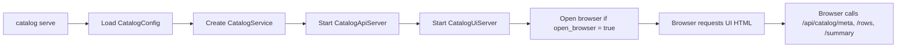
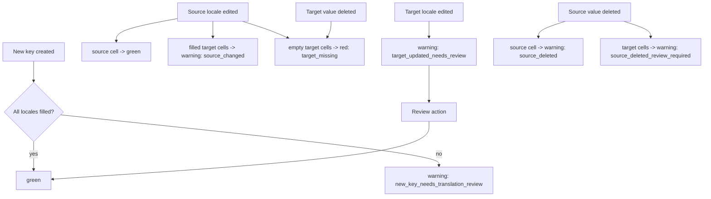
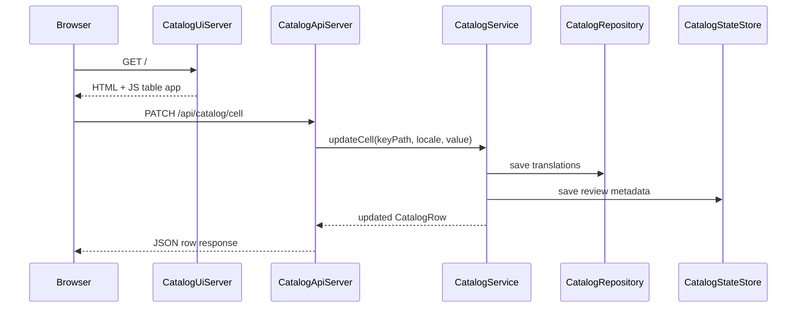

# Catalog Architecture

Use this page when you want to understand how the catalog sidecar is structured internally and how UI actions become file updates plus review-state changes.

## Runtime overview

The catalog runtime is a small sidecar around your locale files:

- `CatalogConfig` loads and resolves the catalog settings
- `CatalogRuntime` starts the API server first, then the UI server
- `CatalogUiServer` serves one embedded HTML table app
- `CatalogApiServer` exposes the JSON routes the table uses
- `CatalogService` contains the write logic and status rules
- `CatalogRepository` reads and writes the translation files
- `CatalogStateStore` persists review metadata in the state file
- `CatalogStatusEngine` computes source hashes and cell-state transitions



## Main responsibilities

### `CatalogConfig`

`CatalogConfig` loads `anas_catalog.yaml`, applies defaults, and resolves relative paths against the project root.

Important behavior:

- `source_locale: null` falls back to `fallback_locale`
- `lang_dir` and `state_file` can be relative or absolute
- `format` determines how locale files are loaded and saved

### `CatalogUiServer`

`CatalogUiServer` serves a single HTML page plus a `/health` endpoint. There is no separate frontend build step in this branch. The page contains the search bar, summary pills, locale table, and `+ New String` modal.

### `CatalogApiServer`

`CatalogApiServer` is a thin HTTP layer. It:

- accepts browser and tool requests
- parses JSON bodies
- forwards operations to `CatalogService`
- returns JSON rows, summaries, or `{ "ok": true }`

The current route surface is:

```text
GET /api/catalog/meta
GET /api/catalog/rows
GET /api/catalog/summary
POST /api/catalog/key
PATCH /api/catalog/cell
DELETE /api/catalog/cell
POST /api/catalog/review
DELETE /api/catalog/key
```

### `CatalogService`

`CatalogService` is the core orchestration layer. It is responsible for:

- loading locale data and the persisted catalog state
- syncing saved state to the current file contents
- building table rows and summary counts
- applying add, edit, review, and delete operations
- deciding which cells should be `green`, `warning`, or `red`

### `CatalogRepository`

`CatalogRepository` owns the actual translation files. It reads and writes the configured locale format and returns the merged dataset the service uses.

### `CatalogStateStore`

`CatalogStateStore` owns the JSON sidecar state file. That file stores:

- the selected source locale
- the configured format
- per-key source hashes
- per-locale cell status and review metadata

It does not store the real translations themselves.

### `CatalogStatusEngine`

`CatalogStatusEngine` is deliberately small. It hashes source values and provides the primitives that mark cells:

- `green`
- `warning`
- `red`

It also defines the reason strings the UI exposes, such as `source_changed`, `target_missing`, and `target_updated_needs_review`.

## Status lifecycle



## Write path



## Source of truth model

The catalog uses two different persistence layers on purpose:

- translation files are the source of truth for localized content
- the catalog state file is the source of truth for review state and source hashes

At load time, `CatalogService._loadAndSyncState()` reconciles them. If the files changed outside the UI, the service recomputes row states before it returns data to the browser.

## Why the split matters

This design keeps the catalog useful for both teams and automation:

- translators can work in the browser
- engineers can still edit JSON, YAML, CSV, or ARB directly
- external scripts can call the API
- the service can detect stale review state when source values change outside the UI

## Next

- [Setup and Serve](setup-and-serve.md)
- [Edit and Review Flow](edit-and-review-flow.md)
- [Bulk Operations and API](bulk-and-api.md)
- [Config Reference](../reference/config-reference.md)
