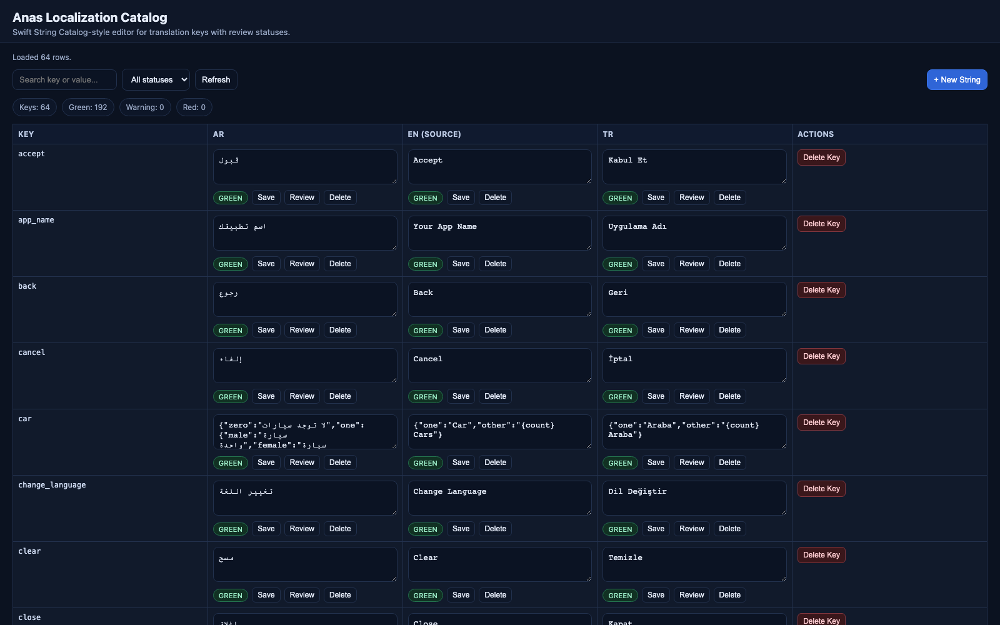
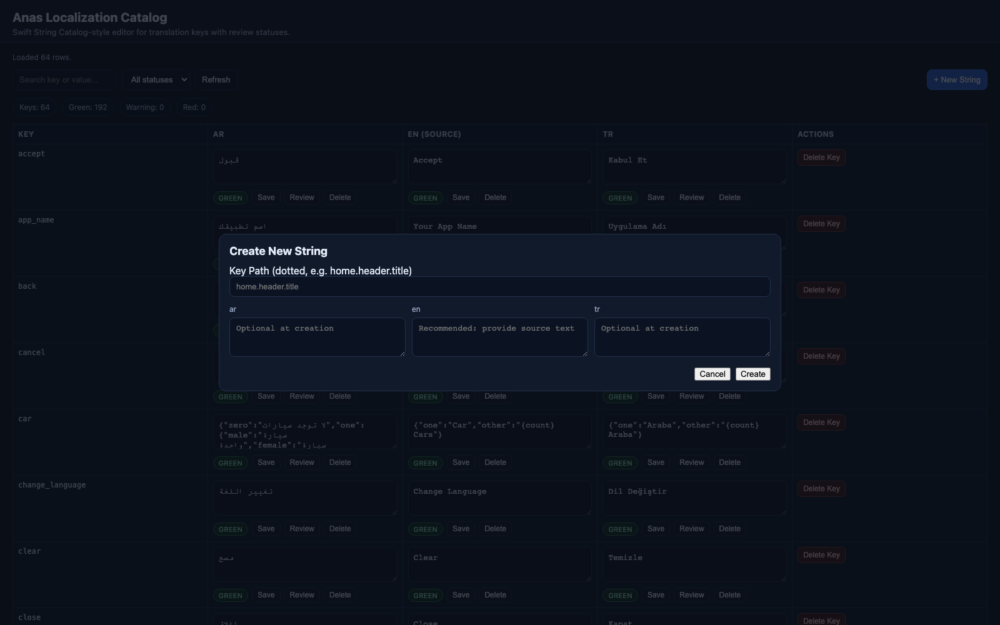

# Edit and Review Flow

Use this page when you want to understand how keys move through create, edit, review, and delete actions in the catalog table.

## The table model

Each row is one dotted key path such as `home.header.title`. Each locale column stores:

- the current translated value
- a status color
- an optional status reason
- actions such as `Save`, `Review`, `Delete`, or `Delete Key`



## Status meanings

- `green`: the cell is in sync or explicitly reviewed
- `warning`: the cell needs reviewer attention
- `red`: the target value is missing and needs work

Common reasons from the runtime state engine:

- `source_changed`
- `source_added`
- `source_deleted`
- `source_deleted_review_required`
- `target_missing`
- `new_key_needs_translation_review`
- `target_updated_needs_review`

## Create a new key

From the UI, use `+ New String`.



From the CLI:

```bash
dart run anas_localization:anas_cli catalog add-key --key=home.header.title --value-en="Home" --value-tr="Ana Sayfa" --value-ar="الصفحة الرئيسية"
```

What happens:

- the key is created across every configured locale file
- if every locale value is filled at creation time, all cells can start `green`
- if some locale values are empty, the row starts in a review-needed state

## Edit a source-locale value

When you update the source locale cell:

- the source cell becomes `green`
- non-source locales with values become `warning` with `source_changed`
- non-source locales without values become `red` with `target_missing`

This is the main way the catalog surfaces stale translations after source text changes.

## Edit a target-locale value

When you update a non-source locale cell:

- a non-empty value becomes `warning` with `target_updated_needs_review`
- an empty value becomes `red` with `target_missing`

To move a filled target cell back to `green`:

```bash
dart run anas_localization:anas_cli catalog review --key=home.header.title --locale=tr
```

The UI `Review` button calls the same service path as the CLI.

## Delete a value or a whole key

Delete a whole key across all locales:

```bash
dart run anas_localization:anas_cli catalog delete-key --key=home.header.title
```

Important differences:

- the per-cell `Delete` button removes the value only for one locale
- `Delete Key` removes the key from every locale file and clears the saved catalog state for that key
- deleting the source-locale value keeps the row visible and marks the row for review with source-deletion reasons

## Notes

- keys must use dotted segments with letters, numbers, or underscores
- the source locale defaults to `fallback_locale` unless `source_locale` is set
- the catalog UI and CLI both mutate the same translation files and state file

## Next

- [Bulk Operations and API](bulk-and-api.md)
- [Architecture](architecture.md)
- [Catalog Issues](../troubleshooting/catalog.md)
