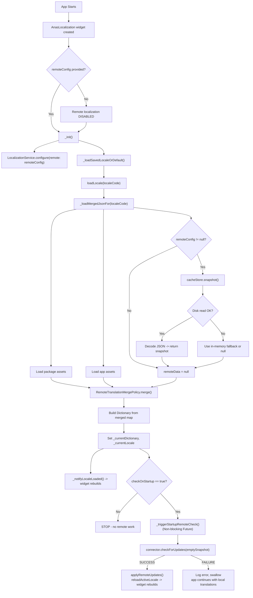
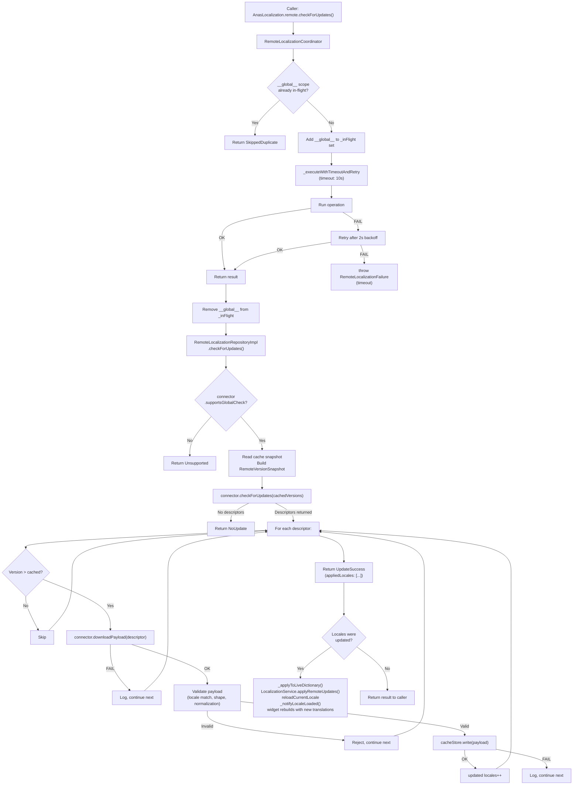
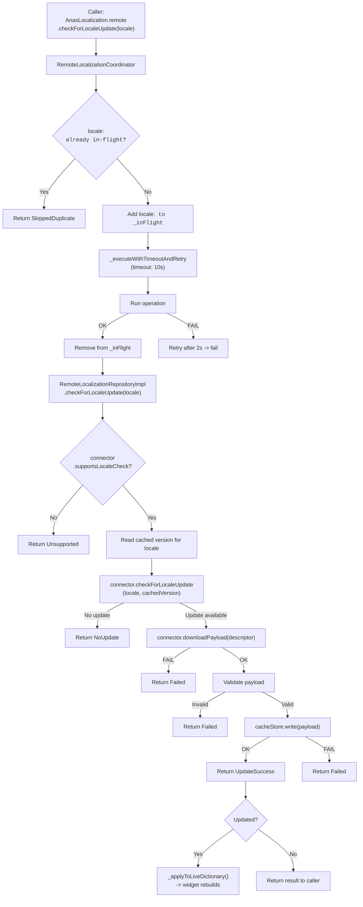
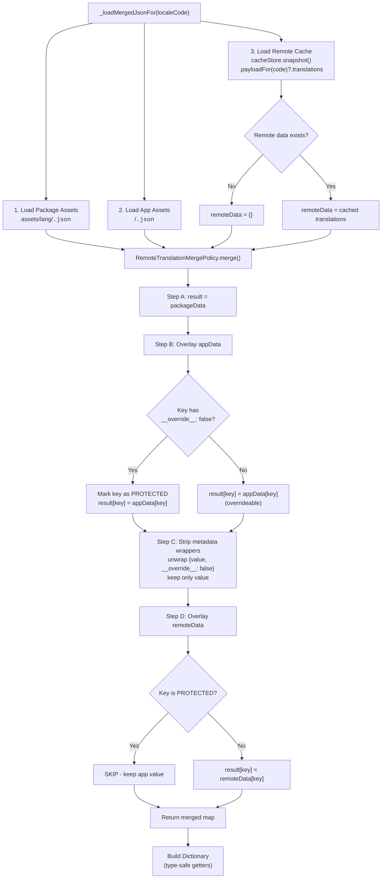
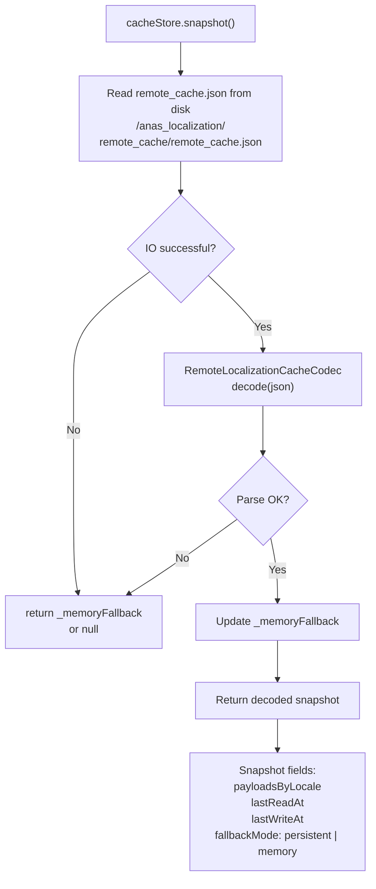
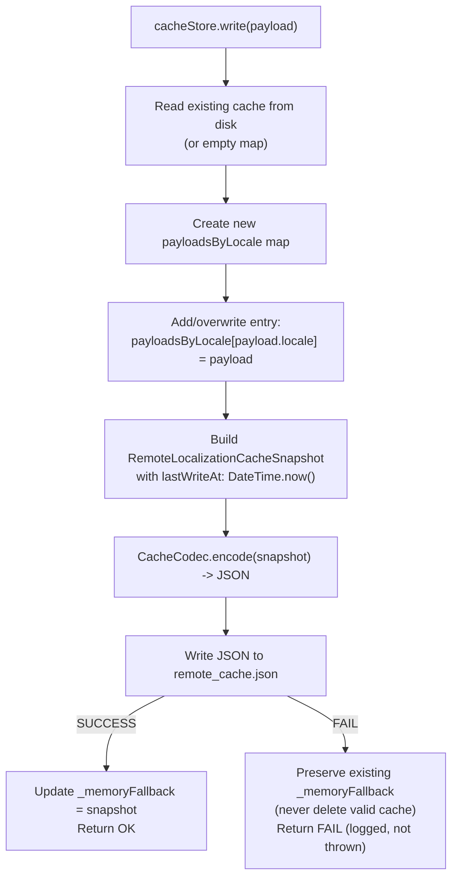
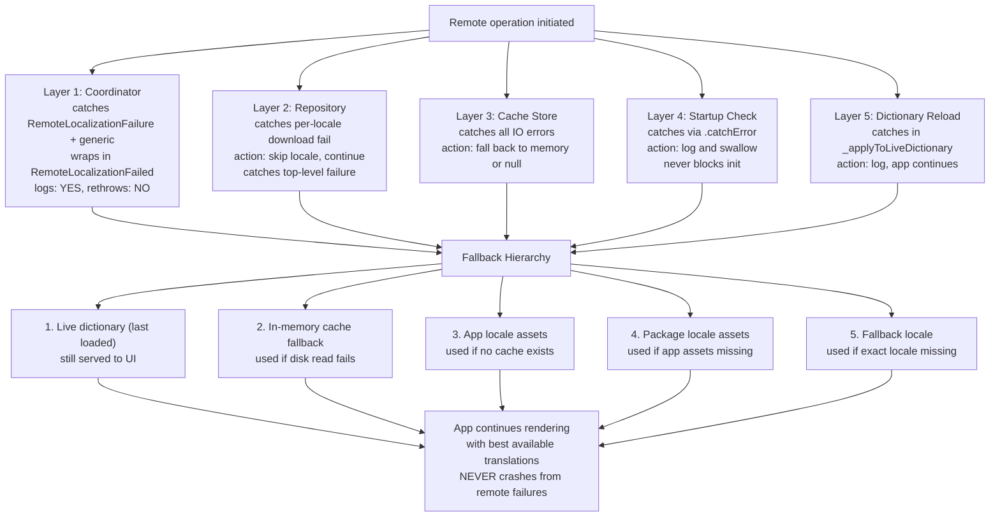
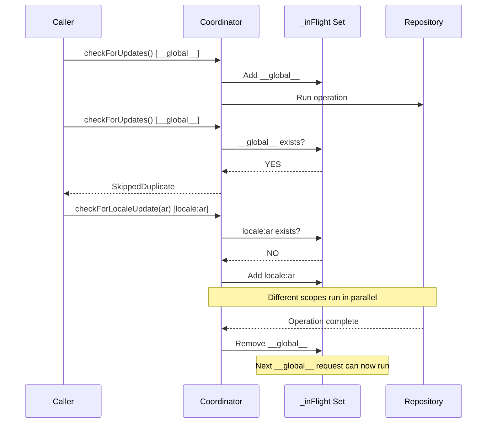
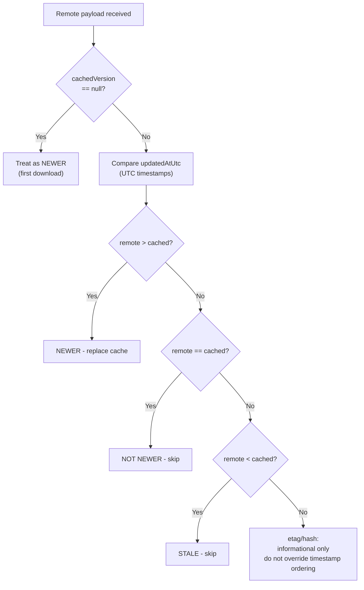

# Remote Localization Flow Diagrams

## 1. App Startup Flow

---

## 2. Manual Global Update Flow

---

## 3. Manual Per-Locale Update Flow

---

## 4. Translation Merge Flow

---

## 5. Cache Read Flow

## 6. Cache Write Flow

---

## 7. Error Boundary Layers

---

## 8. Concurrency & Queue Flow

---

## 9. Version Comparison Flow

---

## Summary: Key Class Responsibilities

| Class | Role in Flow |
|-------|-------------|
| `AnasLocalization` | Entry point. Accepts `remoteConfig`, triggers startup check, exposes `remote` static getter. |
| `RemoteLocalizationConfig` | Holds connector, startup flag, cache store, metrics, timeout/retry constants. |
| `RemoteLocalizationCoordinator` | Orchestrator. Queue/dedup, timeout+retry, lifecycle logging, triggers dictionary reload. |
| `RemoteLocalizationRepositoryImpl` | Business logic. Check-then-download, version validation, cache writes, structured results. |
| `RemoteTranslationMergePolicy` | Merge engine. `package < app < remote` precedence, protected key handling. |
| `RemoteLocalizationFileCacheStore` | Persistent JSON file cache with in-memory fallback via `path_provider`. |
| `RemoteLocalizationCacheCodec` | JSON encode/decode for all remote entities. Returns null on parse failure. |
| `RemoteLocalizationConnector` | Consumer-implemented. Owns backend URLs, auth, request/response mapping. |
| `LocalizationService` | Central singleton. Loads locales, merges remote cache, reloads active locale. |
| `RemoteLocalizationPayload` | Normalized locale data: locale code + version + translations map. |
| `RemoteLocalizationVersion` | UTC timestamp + optional etag/hash. `isNewerThan()` comparison. |
| `RemoteLocalizationUpdateResult` | Sealed outcome: `Success`, `NoUpdate`, `SkippedDuplicate`, `Unsupported`, `Failed`. |
| `RemoteLocalizationFailure` | Sanitized failure with typed code, message, locale, retry status. |
| `RemoteLocalizationMetrics` | Counters: `check`, `download`, `cacheHit`, `cacheMiss`, `failure`. |
